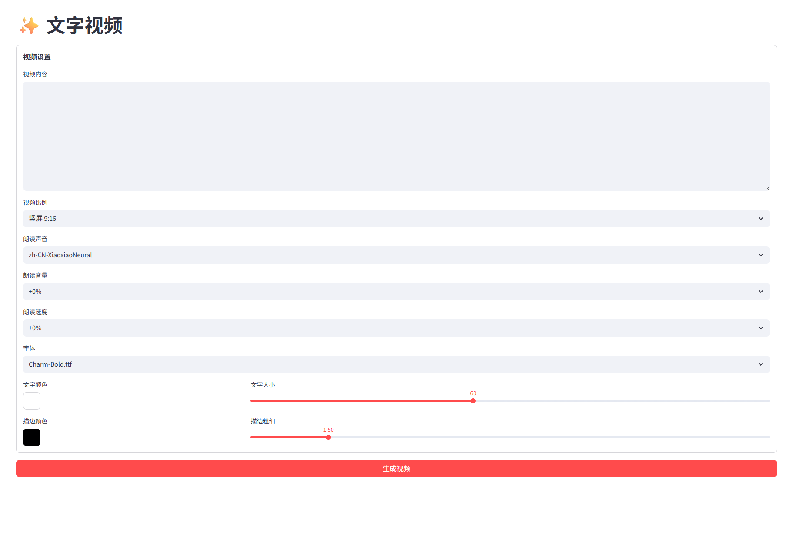
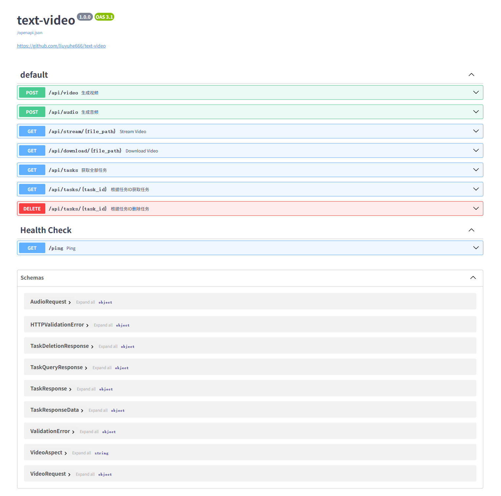

<h1 align="center">✨ 文字视频</h1>

  
  
  
  

<h4>Web 界面</h4>

<h4>API 界面</h4>

## 视频演示 📺

### 竖屏 9:16

<video src="https://github.com/user-attachments/assets/f9905ca0-38c9-42c1-a7c0-0e809721f3d3"></video>

### 横屏 16:9

<video src="https://github.com/user-attachments/assets/07d18095-7091-438f-a5ee-86b8eb87c240"></video>

## 反馈建议 📢

可以提交 [issue](https://github.com/liuyuhe666/text-video/issues) 或者 [pull request](https://github.com/liuyuhe666/text-video/pulls)。

## 许可证 📝

点击查看 [`LICENSE`](LICENSE) 文件
