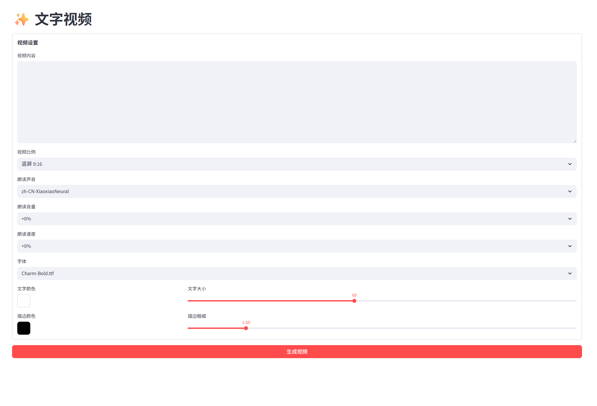
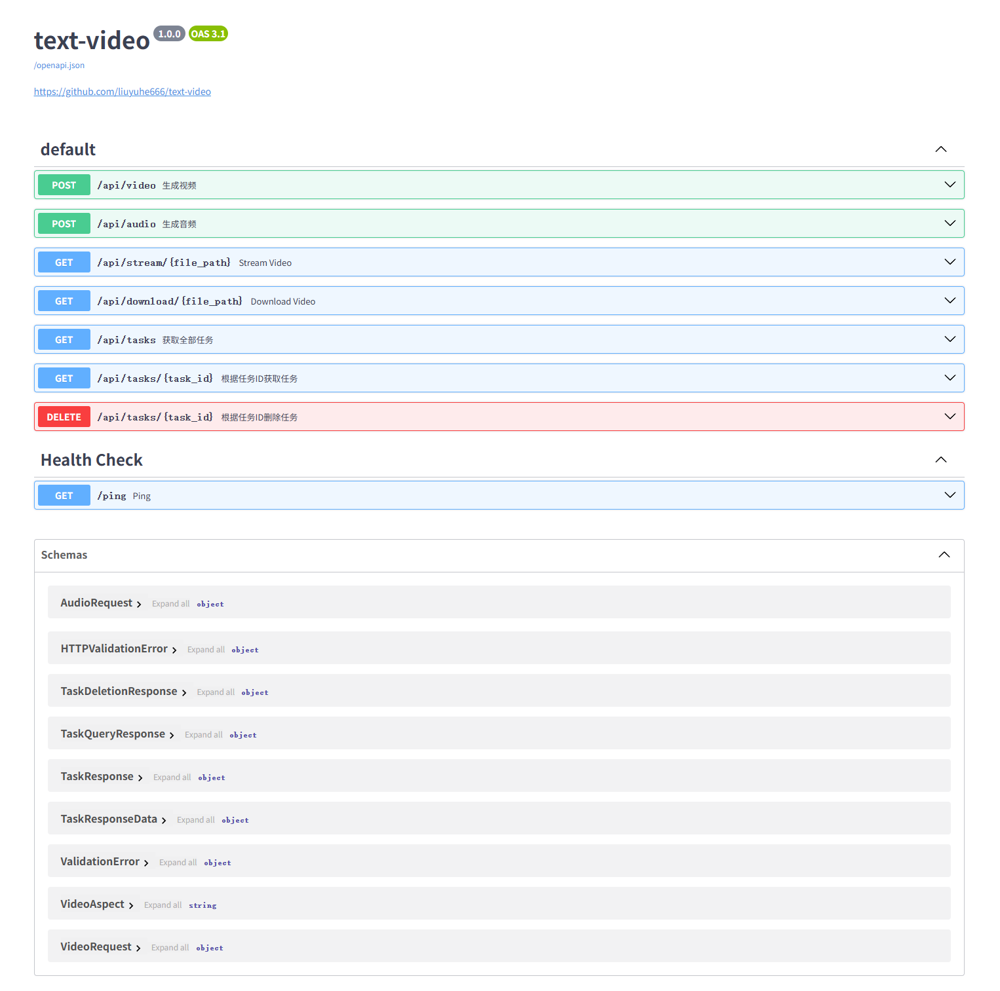

<div align="center">
<h1 align="center">✨ 文字视频</h1>

<p align="center">
  <a href="https://github.com/liuyuhe666/text-video/stargazers"></a>
  <a href="https://github.com/liuyuhe666/text-video/issues"></a>
  <a href="https://github.com/liuyuhe666/text-video/network/members"></a>
  <a href="https://github.com/liuyuhe666/text-video/blob/main/LICENSE"></a>
</p>

<br>
基于 <b>MoviePy</b> 和 <b>edge-tts</b> 开发的文字视频生成工具。
<br>

<h4>Web 界面</h4>



<h4>API 界面</h4>



</div>

## 视频演示 📺

[BV1dyw7zAEEd](https://www.bilibili.com/video/BV1dyw7zAEEd)

### 竖屏 9:16

<video src="https://github.com/user-attachments/assets/f9905ca0-38c9-42c1-a7c0-0e809721f3d3"></video>

### 横屏 16:9

<video src="https://github.com/user-attachments/assets/07d18095-7091-438f-a5ee-86b8eb87c240"></video>

## 快速开始 🚀

本项目使用 [uv](https://github.com/astral-sh/uv) 进行 Python 包管理。

```bash
# 克隆仓库
git clone https://github.com/liuyuhe666/text-video.git
# 切换目录
cd text-video
# 安装依赖
uv sync
```

### 启动 Web 界面 🌏

**Windows**

```bash
webui.bat
```

**MacOS or Linux**

```bash
sh webui.sh
```

启动后，会自动打开浏览器（如果打开是空白，建议换成 Chrome 或者 Edge 打开）

### 启动 API 服务 🚀

```bash
uv run main.py
```

启动后，可以查看 `API文档` `http://127.0.0.1:8080/docs` 或者 `http://127.0.0.1:8080/redoc` 直接在线调试接口，快速体验。

## 字体文件 🅰

字体文件位于项目的 `resource/fonts` 目录下，你也可以放进去自己喜欢的字体。

## 反馈建议 📢

可以提交 [issue](https://github.com/liuyuhe666/text-video/issues) 或者 [pull request](https://github.com/liuyuhe666/text-video/pulls)。

## 许可证 📝

点击查看 [`LICENSE`](LICENSE) 文件

## 参考资料 📚

- [`https://github.com/Zulko/moviepy`](https://github.com/Zulko/moviepy)
- [`https://github.com/rany2/edge-tts`](https://github.com/rany2/edge-tts)
- [`https://github.com/harry0703/MoneyPrinterTurbo`](https://github.com/harry0703/MoneyPrinterTurbo)

## Star History

[](https://www.star-history.com/#liuyuhe666/text-video&Date)
